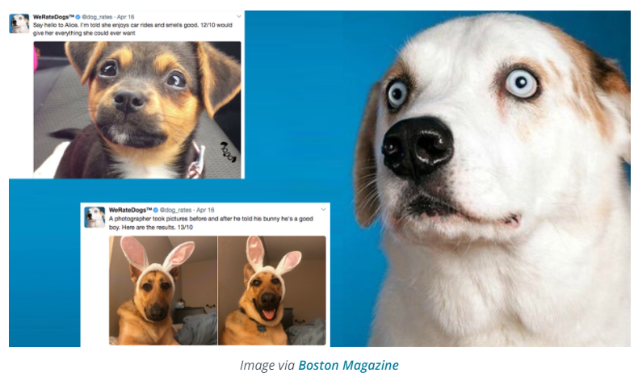

# WeRateDogs
Gathering, assessing and cleaning data from Twitter archive WeRateDogs.

## Introduction

Real-world data rarely comes clean, and the dataset I will wrangle, analyze, and visualize is the tweet archive of Twitter user @dog_rates, also known as WeRateDogs. WeRateDogs is a Twitter account that rates people's dogs with a humorous comment about the dog. These ratings almost always have a denominator of 10. The numerators, though? Almost always greater than 10. 11/10, 12/10, 13/10, etc. Why? Because "they're good dogs Brent." WeRateDogs has over 4 million followers and has received international media coverage.

WeRateDogs downloaded their Twitter archive and sent it to Udacity via email exclusively for the use of this project. This archive contains basic tweet data (tweet ID, timestamp, text, etc.) for all 5000+ of their tweets as they stood on August 1, 2017.

## Summary of Findings

This project mainly focuses on how to obtain and clean real world data. I made a small report describing which quality and tidiness issues I wanted to deal with, how I dealt with them, and what I found. I determined that the most popular dog stage among the dogs rated by WeRateDogs was pupper and the most Tweets come from the iPhone Twitter app. 

## Learning Outcomes

* Gathered data from the WeRateDogs Twitter archive, downloaded images programmatically using the Requests library, and retweet and favourite Tweet counts were gathered from Twitter's API using the Tweepy library.
* Each Tweet from the Tweepy library was stored as JSON data. The JSON data was read and converted into a Pandas DataFrame.
* The data was assessed programmatically, quality and tidiness issues were corrected.
* Stored and analyzed clean data.

## Libraries Used

Pandas, NumPy, Requests, Tweepy, JSON. 
